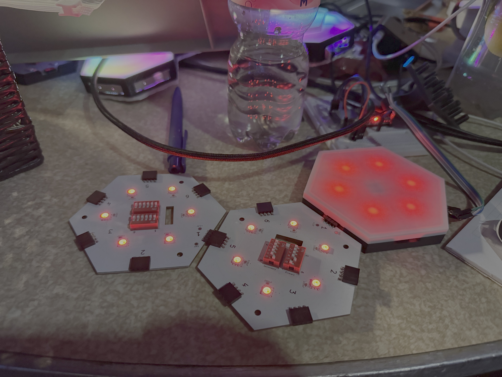

# HexaLeafs

## Description

We like hexagons and blinky lights.
So we thought, why not combine the two?

So we created a PCB in the shape of a hexagon with 6 LEDs on it.
The LEDs are controlled by wled, so you can control them via wifi.

## Design Records

There are many ways to design such a PCB.

We asked ourselves some questions and answered them with the following design decisions:

### Why hexagon?

Hexagons are bestagon ;)

### How To Connect The HexaLeafs With Each Other?

Here we had a lot discussions.

There were many ideas like pogo pins with magnets, spring loaded connectors, or even a custom connector with an extra PCB similar to Nanoleafs.

We asked ourselves what will be the typical use case for this PCB.
We came to the conclusion that the typical use case will be to put them on a wall or a ceiling and that the pattern of the connected PCBs will not change very often.

The connection should be easy to use and easy to connect and disconnect.

We also wanted to keep the cost low.
So we decided to use a simple 4-pin connector with a pitch of 2.54mm which are SMD soldered to the PCB.

### How To Power The HexaLeafs?

We decided to use a USB-C connector for power.
USB-C is a widely used standard and can deliver enough power for the LEDs.

### Which LEDs To Use?

We decided to use WS2815E LEDs.
They are similar to the well known WS2812 LEDs but have a higher voltage of 12V instead of 5V which makes them more suitable for longer LED strips.
The higher voltage also means that the current is lower which makes it easier to design the PCB.

### Area of One HexaLeaf?

The edge length of one HexaLeaf is 52mm.
The area of one HexaLeaf is 7025.198mm^2 = 0.007025198 m^2 (square meters).

10 Hexaleafs = 60 LEDs, they consume at 12V at full white brightness 0.25A in total.
The power consumption of 10 HexaLeafs is 3W.

Power Delivery of USB-C at 12V can be up to 60W.

-> 200 HexaLeafs can be powered by one USB-C port.
Which is 1.40504 m^4 (meters to the fourth) of LED area.

Standby is 0.102A, all LEDs off. TODO: Make a relais to switch off the power supply for the LEDs.
Nice to have feature! Not mandatory.

## Open Questions

### How To Mount The HexaLeafs To The Wall?

### Foo

